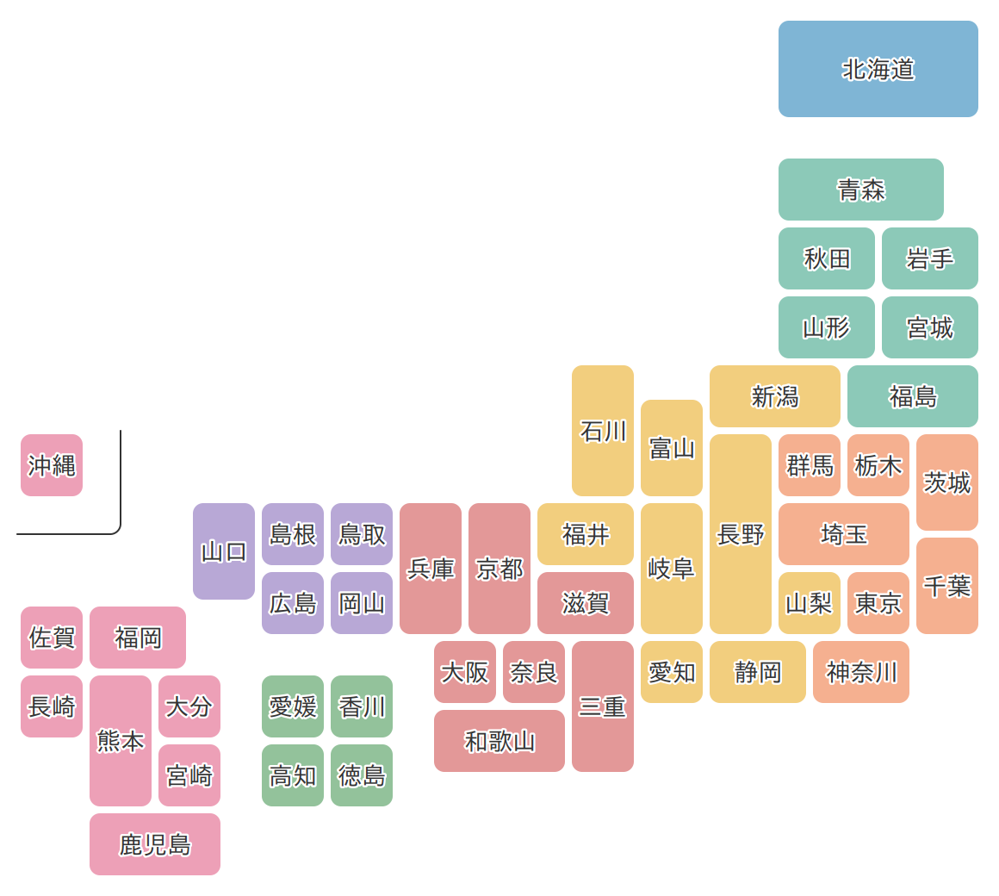

# デフォルメ日本地図 / Deformed Map of Japan



都道府県を単純な四角形の組み合わせに簡略化した日本地図です。全図形が **5mm四方のグリッド（28×25セル）** に乗っており、SVG・JSONの2形式で提供します。データ可視化やWebサイト、AIとの対話など、自由に使えます。

- **SVG** — 全座標が整数（1セル = 10単位）。各都道府県に `id="JP-13"`（ISO 3166-2:JP）付き
- **JSON** — 1セル1文字のテキストグリッド。プログラムからもLLMからもそのまま読めます

## ファイル

| ファイル | 内容 |
|---|---|
| `data/japan.grid.json` | 正データ（グリッド＋凡例）。編集するのはこのファイルだけ |
| `dist/japan.svg` | 白地図（境界線あり） |
| `dist/japan-rounded.svg` | 角丸・県ごとに隙間のあるスタイル |
| `build/generate.py` | JSON → SVG 生成スクリプト |
| `examples/` | 使用例（CSS Grid描画・SVG塗り分け） |

## 使い方

### ダウンロードして使う

[Releases](https://github.com/chizutodesign/japan-deformed-map/releases/latest) の **Source code (zip)** に一式が入っています。展開して `dist/japan.svg` を Illustrator・Figma・Inkscape などで開けば、そのまま編集できます。

SVG1枚だけ欲しい場合は、次のURLを開いて保存してください。

https://cdn.jsdelivr.net/gh/chizutodesign/japan-deformed-map@v1.0.0/dist/japan.svg

### HTMLで表示する

自分のWebページのHTMLに次の1行を書くと、地図が画像として表示されます。ファイルを自分のサーバーに置く必要はありません。

```html

```

### JavaScriptで塗り分ける

`` で貼った地図は1枚の絵なので、県ごとに色を変えることはできません。塗り分けたいときはSVGをページ内に展開します。

```js
const svg = await (await fetch("dist/japan.svg")).text();
container.innerHTML = svg;
document.querySelector("#JP-13").setAttribute("fill", "tomato"); // 東京都
```

各都道府県の要素には `id`（JP-01〜JP-47）、`data-name`（日本語名）、`data-romaji` が付いています。動作する例は [examples/](examples/) にあります。

### AIに読ませる

`data/japan.grid.json` は約5KBなので、そのままAIチャットに貼れます。グリッドがテキストとして日本列島の形をしているため、位置関係を踏まえた指示ができます。

```
このJSONはデフォルメ日本地図です。太平洋ベルトの県だけを
色分けしたSVGを、legendのコードを使って生成してください。
```

## データ形式

```jsonc
{
  "grid": { "cols": 28, "rows": 25, "cell_size_mm": 5 },
  "legend": { "a": { "code": "01", "name": "北海道", "romaji": "Hokkaido" }, ... },
  "rows": [
    "......................aaaaaa",
    "......................aaaaaa",
    ...
  ]
}
```

`.` は海、英字1文字が1セルです。文字と都道府県の対応は `legend` を参照してください。

## SVGを再生成する

```
python3 build/generate.py
```

`dist/` 以下は生成物です。形を変えたいときは `data/japan.grid.json` を編集して再生成してください。

## ライセンス

地図データと画像（`data/` `dist/` `assets/`）は [CC0 1.0](LICENSE) です。**権利を放棄しています。**
クレジット表示なしで、商用・非商用を問わず自由に利用・改変・再配布できます。許諾を求める必要もありません。

クレジットは任意ですが、表示いただけると嬉しいです。

```
デフォルメ日本地図 by chizutodesign
https://github.com/chizutodesign/japan-deformed-map
```

スクリプト（`build/` `examples/`）は [MIT License](LICENSE-CODE) です。

## 作者

加藤創 / chizutodesign
https://chizutodesign.com/
