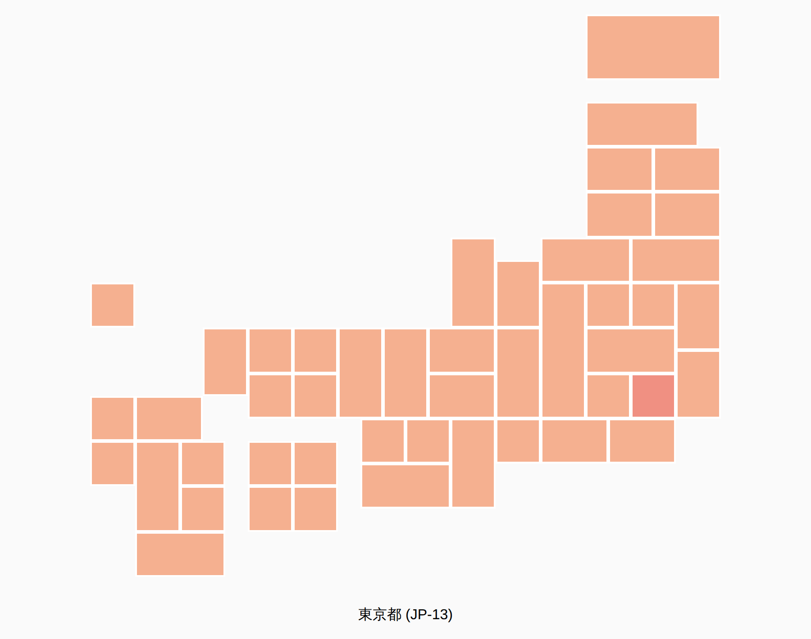
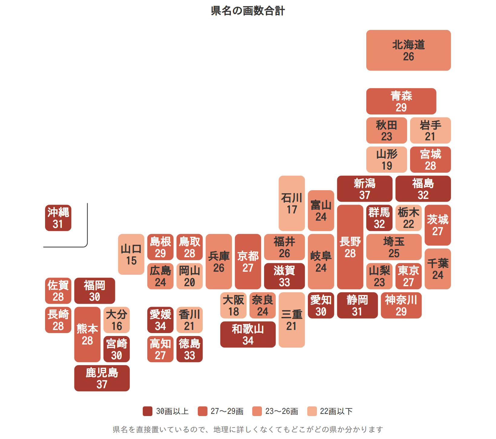

# 使用例

いずれも `fetch()` でデータを読み込むため、**HTMLファイルを直接開いても動きません**。ブラウザは `file://` で開いたページからのファイル読み込みをセキュリティ上ブロックします（コンソールに `blocked by CORS policy` と出ます）。

リポジトリのルートでローカルサーバーを起動してから開いてください。

```
python3 -m http.server
```

→ http://localhost:8000/examples/css-grid.html

## css-grid.html

`data/japan.grid.json` だけで地図を描く例です。1セル=1要素で並べたうえで、隣のセルが別の県のときだけ境界線を引いて、都道府県として結合して見えるようにしています。マウスを乗せるとその県全体が明るくなり、県名が表示されます。

単に地図を表示・塗り分けたいだけなら、都道府県が結合済みの `dist/japan.svg` を使う方が簡単です。



## svg-choropleth.html

`dist/japan-rounded.svg` を読み込んでページに展開し、都道府県ごとに値に応じた色を塗ります（コロプレス図）。`id="JP-13"` のような識別子を使って塗り分けます。


